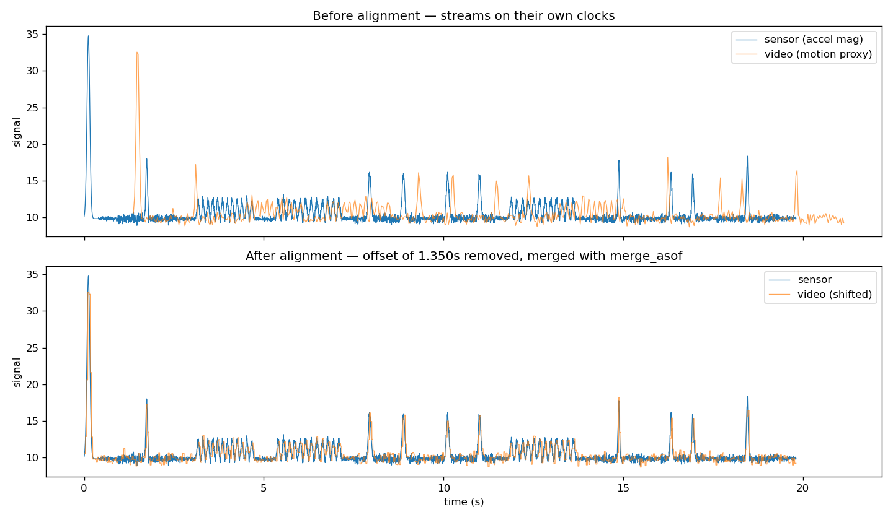

# tactile-sync

A small pipeline for **capturing, synchronizing, and fusing multi-rate sensor streams** — a toy version of the vision + touch data problem at the heart of physical-AI manipulation.

> The hard part of pairing vision with touch isn't either sensor — it's that they
> run on different clocks at different rates, and have to be aligned before the
> data is worth anything. This project builds that alignment core end to end.

## What it does

1. **Capture** two streams of a hand performing manual tasks (stack / flip / screw):
   a high-rate motion sensor (~200 Hz) and a low-rate "video" signal (~30 fps),
   starting at different moments — exactly the mismatch you get from a phone camera
   plus an accelerometer app.
2. **Synchronize** them using a sync marker (a sharp tap at the start, which spikes
   in *both* streams), then merge onto one timeline with `pandas.merge_asof`.
3. **Visualize** the before/after to sanity-check the alignment by eye.
4. **Classify** the action from the fused signal with a random forest.

## Results

- Recovered a hidden **1.370 s** offset to within **20 ms** (about half a video
  frame at 30 fps — the resolution limit of the slower stream).
- **100%** of sensor samples matched to a video frame within tolerance after alignment.
- Action classification: **~94%** test accuracy on windowed features.



The top panel shows the raw streams offset by ~1.4 s; the bottom shows them aligned.

## An honest note on the modality comparison

`classify.py` compares sensor-only vs. sensor+video features and gets the *same*
accuracy. That's expected here: in this **synthetic** data the "video" channel is
derived from the sensor, so it carries no independent information.

This is exactly the gap that real tactile data fills. A camera can't see contact
force or slip; a real tactile glove measures them directly. With genuine
vision+touch capture, the fused model should beat vision-only on grasp/insert tasks
precisely where contact matters — which is the bottleneck companies like
[6thSense](https://www.ycombinator.com/companies) are built to close.

## What I'd do with real tactile gloves instead of an accelerometer

- Swap the accelerometer proxy for real per-fingertip force/pressure channels.
- Replace the `motion_proxy` with actual egocentric video frames + a vision encoder.
- Keep the *exact same* synchronization core — the tap-based marker and `merge_asof`
  alignment generalize directly; only the sensor front-end changes.
- Report the sensor-only vs. sensor+touch comparison on a real grasp task, where
  the touch channel should finally earn its keep.

## Run it

```bash
python3 src/generate_synthetic.py   # make test data (no recording needed)
python3 src/synchronize.py          # align + merge the streams
python3 src/visualize.py            # save figures/alignment.png
python3 src/classify.py             # train + compare modalities
```

## Recording your own data

1. Film your hand doing a repeatable task with your phone (egocentric if you can clip it on).
2. Log accelerometer + gyro with a free app like **Phyphox** (exports timestamped CSV).
3. **Clap or tap firmly at the very start** — that's your sync marker. Make it the
   single biggest impact in the recording so it's unambiguous in both streams.
4. Drop the CSVs into `data/raw/` matching the column names in `generate_synthetic.py`
   and run the same pipeline.

## Structure

```
src/
  generate_synthetic.py  # synthetic test data with a known offset
  synchronize.py         # the sync core: spike detection + merge_asof
  visualize.py           # before/after alignment plot
  classify.py            # windowed features + random forest
data/                    # raw/ and processed/
figures/                 # output plots
```
